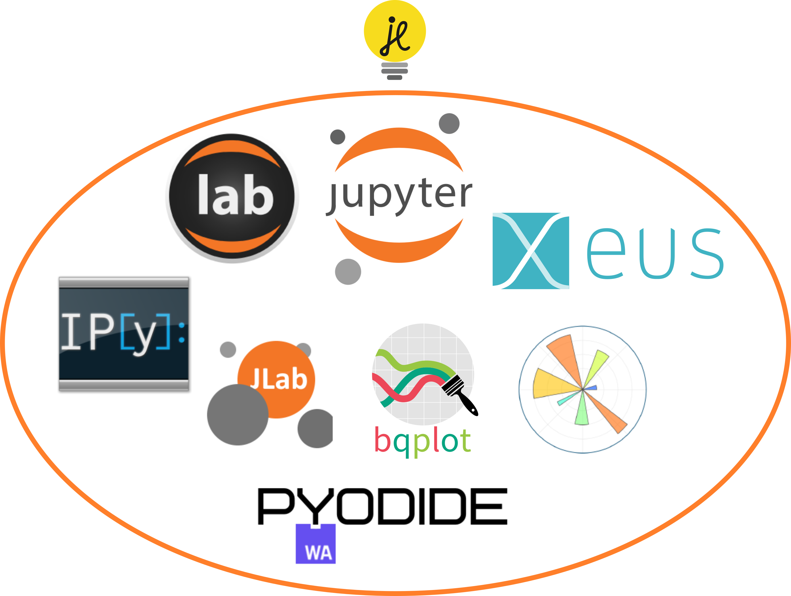

<style>
section::after {
  content: attr(data-marpit-pagination) '/' attr(data-marpit-pagination-total);
}
img[alt~="center"] {
  display: block;
  margin: 0 auto;
}
</style>


# Interactive computing in the browser with Jupyterlite

## JOBIM 2024

### Jérémy Tuloup

https://jtp.io/jobim-2024

---

# Jérémy Tuloup

- Technical Director à QuantStack
- Jupyter Distinguished Contributor
- Jupyter Frontends SSC (Steering Software Council) representative
- Contributor and maintainer of many Jupyter projects
- JupyterLite creator

---

# Quick History


---

# IPython in the terminal


---

# REPL: Read Eval Print Loop

---

# Why are notebooks popular ?

- REPL workflow
- with:
  - **narration**
  - **memory**
  - **reproducibility**
  - **communication**

---

# IPython Notebook


---

# Jupyter Notebook


---

# JupyterLab


---

# LIGO

<div class="columns">


<div>

</div>

<div>

</div>

</div>

---

# Black Hole M87

<div class="columns">

<div>

</div>

<div>


</div>

</div>

---

# The Jupyter ecosystem

- Navigating the Jupyter Landscape
  - JupyterCon 2023 (Paris)
  - Jeremy Tuloup, Johan Mabille
  - https://www.youtube.com/watch?v=uWJ0-OPKTxI

---


---


---

# JupyterLite

- Everything runs in the browser via WebAssembly
- Based on the Jupyter stack:
  - Pyodide and Xeus kernels run code in the browser
  - JupyterLab and Jupyter Notebook interfaces
  - Voici for web applications and dashboards

---

# Jupyter


---

# JupyterLite


---




---

# Wasm powered Jupyter running in the browser

- https://developer.mozilla.org/en-US/docs/WebAssembly


---

# Python in the browser


- Pyodide
- CPython compiled to WebAssembly
- Xeus Python + Emscripten Forge

---


---

# Jupyter and Python in the browser


- ✅ no Python server
- ✅ no command line for users
- ✅ no need to install Python and other packages locally
- ✅ can be hosted as a static site

---

# A Jupyter web site available in a few seconds


---

# `jupyterlite-core`: a static site generator

```shell
pip install jupyterlite-core

jupyter lite build
```

---

# HTML, CSS, JavaScript, Wasm files

<div class="columns">
<div>


```
├── api
│   └── translations
│       ├── all.json
│       └── en.json
├── bootstrap.js
├── build
│   ├── 9507.1e6cc5d.js
│   ├── 9602.62bf0f1.js
│   ├── 9621.e2e8b5d.js
│   ├── ...
│   ├── repl
│   │   ├── bundle.js
│   ├── retro
│   │   ├── bundle.js
│   ├── schemas
│   │   ├── all.json
│   │   ├── @jupyterlab
│   │   │   ├── application-extension
│   │   │   │   ├── commands.json
│   │   │   │   ├── context-menu.json
│   │   │   │   ├── shell.json
│   │   │   │   └── sidebar.json
│   ├── themes
│   │   └── @jupyterlab
│   │       ├── theme-dark-extension
│   │       │   ├── index.css
│   │       │   └── index.js
...
```
</div>
<div>

```
...
│   │       └── theme-light-extension
│   │           ├── index.css
│   │           └── index.js
├── config-utils.js
├── extensions
│       └── xeus-python-kernel
│           └── static
│               ├── numpy-1.24.2-py310h6d2fff6_0.0.data
│               ├── numpy-1.24.2-py310h6d2fff6_0.0.js
│               ├── python-3.10.2-h_hash_26_cpython.0.data
│               ├── python-3.10.2-h_hash_26_cpython.0.js
│               ├── python_data.js
│               ├── remoteEntry.35b4eac217ec6bf078a4.js
├── lab
│   ├── favicon.ico
│   ├── index.html
│   ├── jupyter-lite.ipynb
│   ├── jupyter-lite.json
│   ├── package.json
│   ├── tree
│   │   └── index.html
│   └── workspaces
│       └── index.html
...
```

</div>
</div>


---

# Easy to deploy

Served via well-cacheable, static HTTP(S) on most static web hosts

<div class="columns">
<div>


</div>
<div>


</div>
</div>

---

# Use cases

---


```html
<iframe
  src="https://jupyterlite.github.io/demo/repl/index.html?kernel=python&toolbar=1"
  width="100%"
  height="500px"
>
</iframe>
```

---

<iframe
  src="https://jtp.io/jobim-2024/lite/repl/index.html?kernel=python&toolbar=1&code=%pip%20install%20-q%20%22ipymolstar==0.0.5%22%20%22anywidget==0.9.2%22&code=from%20ipymolstar%20import%20PDBeMolstar&code=view%20=%20PDBeMolstar(%20molecule_id=%221qyn%22,%20theme=%22light%22,%20hide_water=True,%20visual_style=%22cartoon%22,%20)"
  width="100%"
  height="500px"
>
</iframe>

---


---

<video
  controls
  width="100%"
  height="600px"
  src="https://github.com/jtpio/alposs-2024/assets/591645/9b5e247d-cb89-4b15-aba3-97e5ab381bb5">
</video>

---

https://github.com/rowanc1/myst-lite

<video
  controls
  width="100%"
  height="600px"
  src="https://github.com/rowanc1/myst-lite/assets/913249/c62478d3-fc90-4350-8006-9a65846a2f26">

</video>

---

# 🎓 Education

- Capytale: https://capytale.fr
- Paris Saclay: https://jupyter.gitlab.dsi.universite-paris-saclay.fr/tutoriel-jupyter/utiliser.html
- UC Berkeley
- LabNBook (Université Grenoble Alpes): https://labnbook.fr/les-labdocs-code-sont-disponibles-dans-labnbook-integration-de-jupyterlite/
- Grenoble INP UGA Phelma: https://phelma-sicom.gricad-pages.univ-grenoble-alpes.fr/1a/3pmpols6-cours/TD_1.html

---

# ⌛ Reproducibility time capsule

- WebAssembly is a web standard
- Runnable for much longer than native binary packages


---

# :rocket: Deploy to GitHub Pages

- https://github.com/jupyterlite/demo


---

https://jupyterlite.github.io/demo/


---

# :test_tube: Current developments

- In-browser terminal
- AI code completions and chat
- Real Time Collaboration via WebRTC
- Emscripten Forge and Conda Forge

---

# :sparkles: Demo :sparkles:

https://jtpio.github.io/jobim-2024/lite

---

# :sparkles: AI code completions and chat

<video
  controls
  width="100%"
  height="600px"
  src="https://github.com/jupyterlite/jupyterlab-codestral/assets/591645/855c4e3e-3a63-4868-8052-5c9909922c21">

</video>

---

# 🔍 References

- Jupyter documentation: https://docs.jupyter.org
- This presentation:
  - Repo: https://github.com/jtpio/jobim-2024
  - Slides: https://jtp.io/jobim-2024

---

# Thanks !
